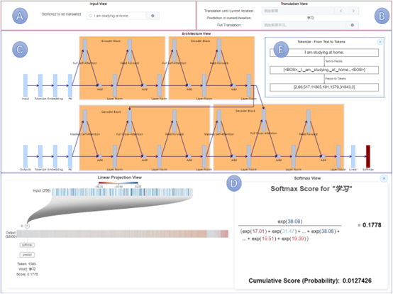
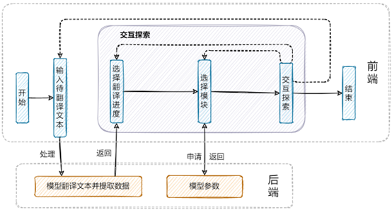
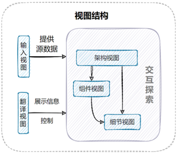

# Explainable Transformer







Transformer的可解释性相关工作, 利用可视化的方式展示 Transformer 模型在进行推理时模型内部计算单元的运行机制, 整个工作是一个可视化系统

后端模型 Transformer 实现参考自 [ChineseNMT](https://github.com/hemingkx/ChineseNMT) ,  并在此基础上有一定的修改

系统后端使用 [Flask](https://dormousehole.readthedocs.io/en/latest/) 搭建

前端系统使用 [Vue3](https://v3.cn.vuejs.org/) 搭建, 可视化部分主要使用 [D3](https://github.com/d3/d3) 实现, 网络图部分则使用到了[G6](https://github.com/antvis/G6)

在 ```./system/client/``` 内是系统前端部分的代码, ```./system/server/``` 内是系统后端部分(包括模型)的代码, ```./ChineseNMT/``` 内主要是模型相关的代码


